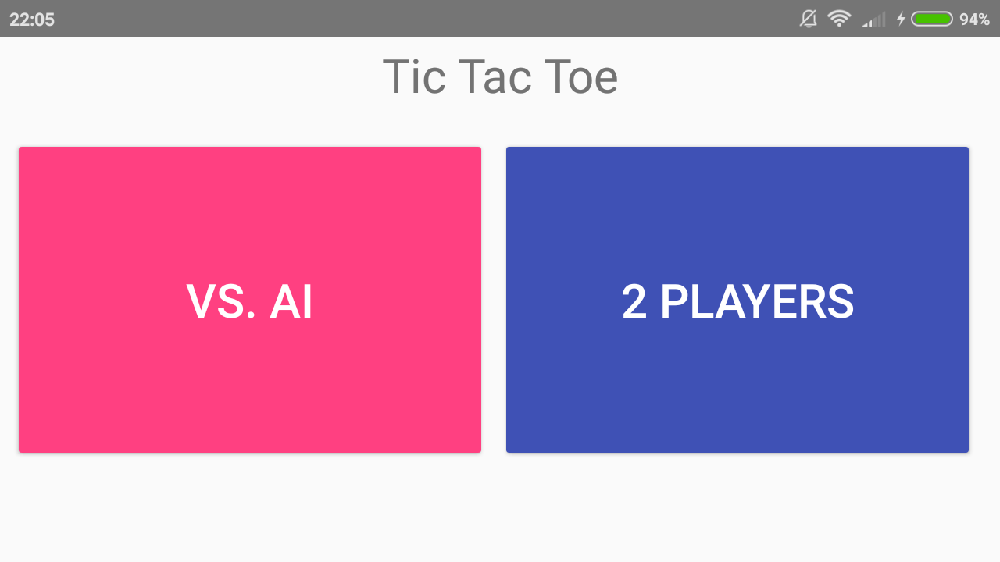
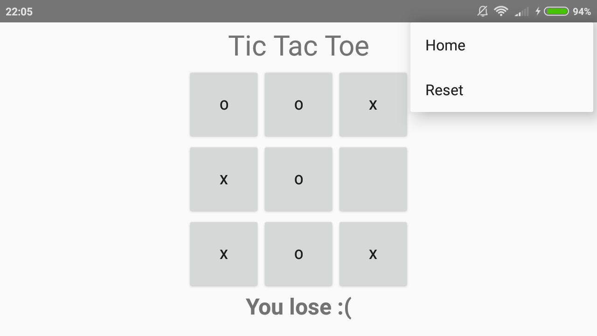
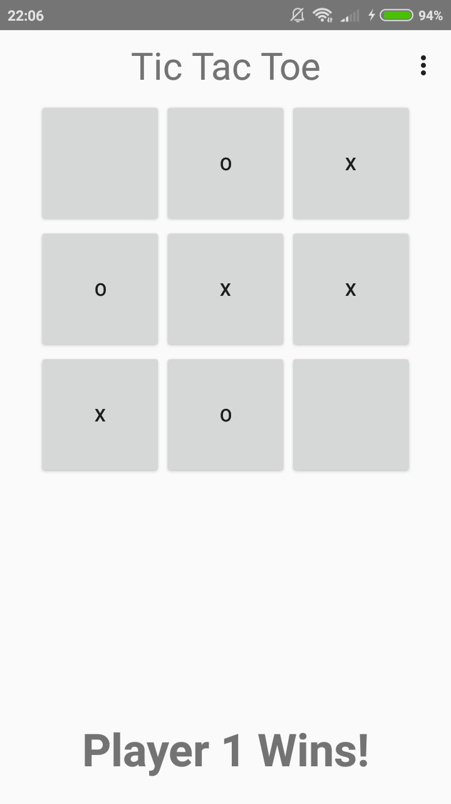

# TicTacToe
pset2

Made by: Shankara van de Ven
         11000791

The Java exercises for the second week can be found here: 
https://github.com/Shankaroe/Native-App-Java/tree/master/week2

This is the first app for the Native App Development course at the University of Amsterdam

